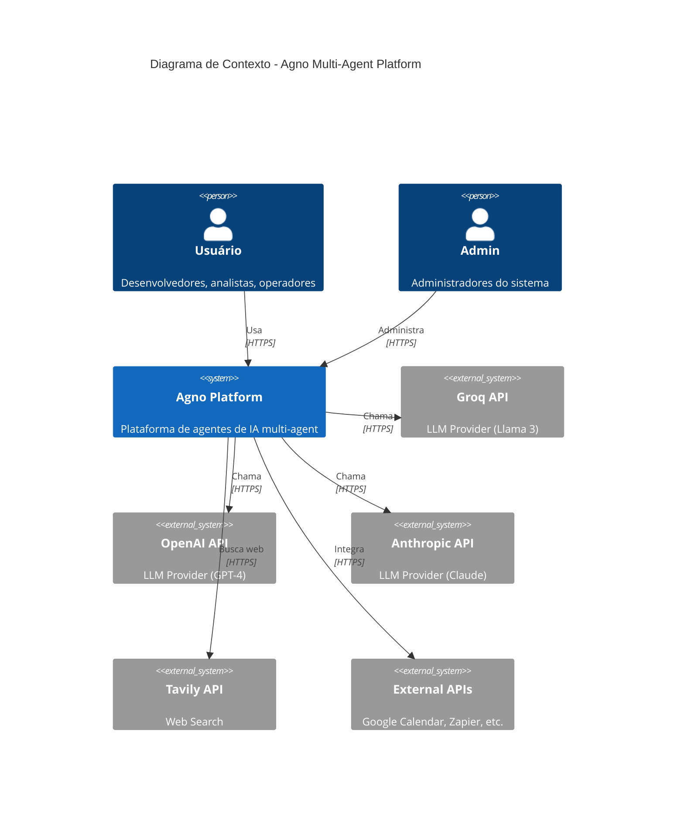
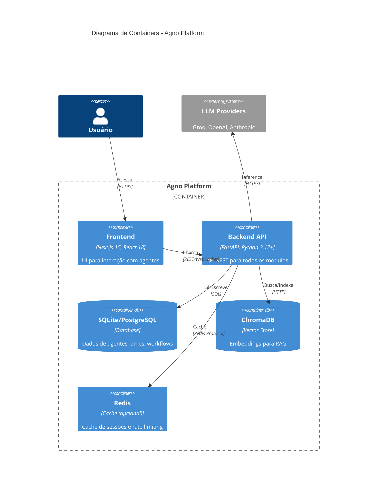

# Visão C4

> Documentação arquitetural usando o modelo C4 (Context, Container, Component).

---

## Nível 1: Contexto do Sistema

Mostra o sistema e suas interações com usuários e sistemas externos.



### Diagrama Simplificado (ASCII)

```
                    ┌─────────────┐
                    │   Usuário   │
                    └──────┬──────┘
                           │ HTTPS
                           ▼
    ┌──────────────────────────────────────────┐
    │         AGNO MULTI-AGENT PLATFORM        │
    │                                          │
    │  ┌──────────┐  ┌──────────┐  ┌────────┐ │
    │  │ Frontend │  │ Backend  │  │  Data  │ │
    │  │ Next.js  │  │ FastAPI  │  │  Layer │ │
    │  └──────────┘  └──────────┘  └────────┘ │
    └──────────────────┬───────────────────────┘
                       │
         ┌─────────────┼─────────────┐
         ▼             ▼             ▼
    ┌─────────┐  ┌──────────┐  ┌──────────┐
    │  Groq   │  │  OpenAI  │  │ Anthropic│
    │   API   │  │   API    │  │   API    │
    └─────────┘  └──────────┘  └──────────┘
```

---

## Nível 2: Containers

Mostra os containers (aplicações/serviços) que compõem o sistema.



### Diagrama Simplificado (ASCII)

```
┌─────────────────────────────────────────────────────────────┐
│                     AGNO PLATFORM                            │
│                                                              │
│  ┌─────────────────┐          ┌─────────────────┐           │
│  │    FRONTEND     │   REST   │     BACKEND     │           │
│  │                 │◄────────►│                 │           │
│  │  - Next.js 15   │          │  - FastAPI      │           │
│  │  - React 18     │          │  - Python 3.12+ │           │
│  │  - TailwindCSS  │          │  - Agno         │           │
│  │  - Zustand      │          │                 │           │
│  │                 │          │  Módulos:       │           │
│  │  Páginas:       │          │  - agents/      │           │
│  │  - /chat        │          │  - teams/       │           │
│  │  - /agents      │          │  - workflows/   │           │
│  │  - /dashboard   │          │  - rag/         │           │
│  │  - /flow-studio │          │  - auth/        │           │
│  │                 │          │  - ...          │           │
│  └─────────────────┘          └────────┬────────┘           │
│                                        │                     │
│         ┌──────────────────────────────┼──────────────┐     │
│         ▼                              ▼              ▼     │
│  ┌─────────────┐              ┌─────────────┐  ┌─────────┐ │
│  │   SQLite/   │              │  ChromaDB   │  │  Redis  │ │
│  │  PostgreSQL │              │  (Vectors)  │  │ (Cache) │ │
│  └─────────────┘              └─────────────┘  └─────────┘ │
│                                                              │
└─────────────────────────────────────────────────────────────┘
                              │
                              ▼
              ┌───────────────────────────┐
              │      LLM PROVIDERS        │
              │  Groq │ OpenAI │ Claude   │
              └───────────────────────────┘
```

---

## Nível 3: Componentes (Backend)

Mostra os componentes internos do Backend API.

```mermaid
C4Component
    title Diagrama de Componentes - Backend API

    Container_Boundary(backend, "Backend API") {
        Component(server, "Server", "server.py", "Entrypoint FastAPI, lifespan, routers")

        Component_Boundary(core, "Core Modules") {
            Component(agents, "Agents", "src/agents/", "Agentes base e especializados")
            Component(teams, "Teams", "src/teams/", "Times multi-agente")
            Component(workflows, "Workflows", "src/workflows/", "Pipelines e workflows")
            Component(rag, "RAG", "src/rag/", "Retrieval-Augmented Generation")
        }

        Component_Boundary(studio, "Studio Modules") {
            Component(flow_studio, "Flow Studio", "src/flow_studio/", "Visual workflow builder")
            Component(domain_studio, "Domain Studio", "src/domain_studio/", "Domínios especializados")
            Component(team_orch, "Team Orchestrator", "src/team_orchestrator/", "Orquestração de times")
            Component(dashboard, "Dashboard", "src/dashboard/", "Observabilidade")
        }

        Component_Boundary(infra, "Infrastructure") {
            Component(auth, "Auth", "src/auth/", "JWT + RBAC")
            Component(observability, "Observability", "src/observability/", "Logs, metrics, health")
            Component(os_routes, "OS Routes", "src/os/routes/", "Routers modulares")
        }
    }

    Rel(server, agents, "Usa")
    Rel(server, os_routes, "Include routers")
    Rel(agents, rag, "Consulta")
    Rel(teams, agents, "Compõe")
    Rel(workflows, agents, "Executa")
```

### Diagrama Simplificado (ASCII)

```
┌──────────────────────────────────────────────────────────────────┐
│                         BACKEND API                               │
│                                                                   │
│  ┌─────────────────────────────────────────────────────────────┐ │
│  │                        server.py                             │ │
│  │  FastAPI app + lifespan + middleware + routers               │ │
│  └───────────────────────────┬─────────────────────────────────┘ │
│                              │                                    │
│  ┌───────────────────────────┼───────────────────────────────┐   │
│  │                    CORE MODULES                            │   │
│  │  ┌──────────┐  ┌──────────┐  ┌──────────┐  ┌──────────┐  │   │
│  │  │ agents/  │  │  teams/  │  │workflows/│  │   rag/   │  │   │
│  │  │          │  │          │  │          │  │          │  │   │
│  │  │BaseAgent │  │  Team    │  │ Workflow │  │RagService│  │   │
│  │  │Registry  │  │ Pipeline │  │ Registry │  │ Chunking │  │   │
│  │  └──────────┘  └──────────┘  └──────────┘  └──────────┘  │   │
│  └───────────────────────────────────────────────────────────┘   │
│                                                                   │
│  ┌───────────────────────────────────────────────────────────┐   │
│  │                   STUDIO MODULES                           │   │
│  │  ┌──────────┐  ┌──────────┐  ┌──────────┐  ┌──────────┐  │   │
│  │  │  flow_   │  │ domain_  │  │  team_   │  │dashboard/│  │   │
│  │  │ studio/  │  │ studio/  │  │orchestr/ │  │          │  │   │
│  │  │          │  │          │  │          │  │          │  │   │
│  │  │ Engine   │  │ Engines  │  │ Engine   │  │ Insights │  │   │
│  │  │ Executor │  │ Registry │  │ Modes    │  │ Metrics  │  │   │
│  │  └──────────┘  └──────────┘  └──────────┘  └──────────┘  │   │
│  └───────────────────────────────────────────────────────────┘   │
│                                                                   │
│  ┌───────────────────────────────────────────────────────────┐   │
│  │                   INFRASTRUCTURE                           │   │
│  │  ┌──────────┐  ┌──────────┐  ┌──────────┐  ┌──────────┐  │   │
│  │  │  auth/   │  │observab/ │  │os/routes/│  │middleware│  │   │
│  │  │          │  │          │  │          │  │          │  │   │
│  │  │ JWT      │  │ Health   │  │ Auth     │  │RateLimit │  │   │
│  │  │ RBAC     │  │ Logging  │  │ Agents   │  │ CORS     │  │   │
│  │  │ SSO      │  │ Metrics  │  │ Teams    │  │          │  │   │
│  │  └──────────┘  └──────────┘  └──────────┘  └──────────┘  │   │
│  └───────────────────────────────────────────────────────────┘   │
│                                                                   │
└──────────────────────────────────────────────────────────────────┘
```

---

## Nível 3: Componentes (Frontend)

```
┌──────────────────────────────────────────────────────────────────┐
│                          FRONTEND                                 │
│                                                                   │
│  ┌─────────────────────────────────────────────────────────────┐ │
│  │                     app/ (App Router)                        │ │
│  │  ┌──────┐ ┌──────┐ ┌──────┐ ┌──────┐ ┌──────┐ ┌──────┐    │ │
│  │  │ chat │ │agents│ │dashb.│ │ flow │ │domain│ │ team │    │ │
│  │  │  /   │ │  /   │ │  /   │ │studio│ │studio│ │orch. │    │ │
│  │  └──────┘ └──────┘ └──────┘ └──────┘ └──────┘ └──────┘    │ │
│  └─────────────────────────────────────────────────────────────┘ │
│                                                                   │
│  ┌─────────────────────────────────────────────────────────────┐ │
│  │                    components/                               │ │
│  │  ┌──────┐ ┌──────┐ ┌──────┐ ┌──────┐ ┌──────┐             │ │
│  │  │  ui/ │ │agents│ │ chat │ │ flow │ │shared│             │ │
│  │  │shadcn│ │      │ │      │ │      │ │      │             │ │
│  │  └──────┘ └──────┘ └──────┘ └──────┘ └──────┘             │ │
│  └─────────────────────────────────────────────────────────────┘ │
│                                                                   │
│  ┌──────────────┐  ┌──────────────┐  ┌──────────────┐           │
│  │    hooks/    │  │     lib/     │  │    store/    │           │
│  │              │  │              │  │              │           │
│  │ use-agents   │  │ api.ts       │  │ app-store    │           │
│  │ use-chat     │  │ utils.ts     │  │ (Zustand)    │           │
│  └──────────────┘  └──────────────┘  └──────────────┘           │
│                                                                   │
└──────────────────────────────────────────────────────────────────┘
```

---

## Fluxo de Dados

### Request Típico

```
┌────────┐    ┌─────────┐    ┌─────────┐    ┌─────────┐    ┌─────────┐
│ Client │───►│ Frontend│───►│ Backend │───►│   LLM   │───►│ Response│
└────────┘    └─────────┘    └─────────┘    └─────────┘    └─────────┘
                  │               │
                  │               ▼
                  │          ┌─────────┐
                  │          │ChromaDB │ (se RAG)
                  │          └─────────┘
                  │               │
                  │               ▼
                  │          ┌─────────┐
                  └─────────►│ SQLite  │ (persistência)
                             └─────────┘
```

---

## Decisões Arquiteturais Relacionadas

- [ADR-001: Stack Tecnológica](../adr_v2/decisions/10-architecture/001-stack-tecnologica.md)
- [ADR-002: Arquitetura Modular](../adr_v2/decisions/10-architecture/002-arquitetura-modular.md)
