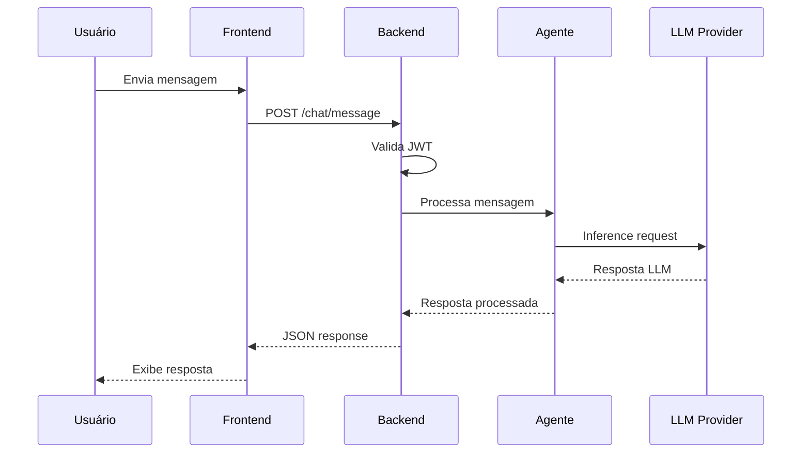
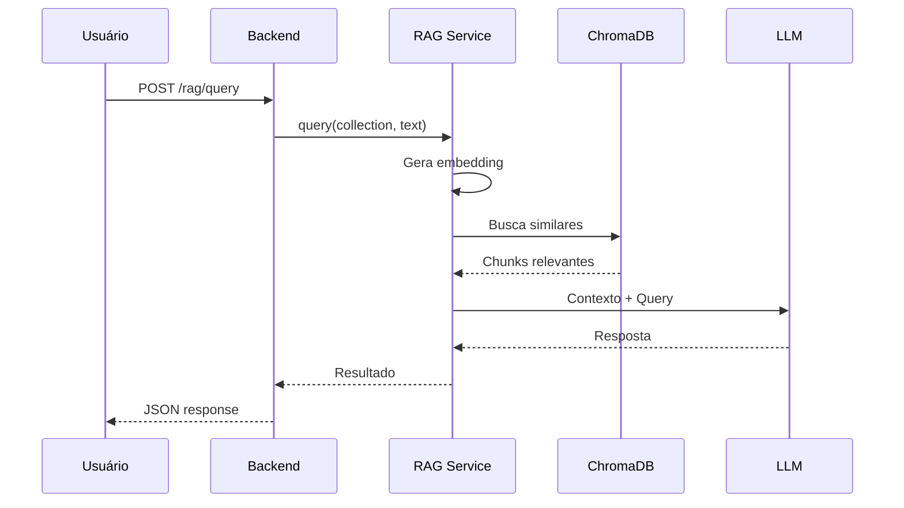
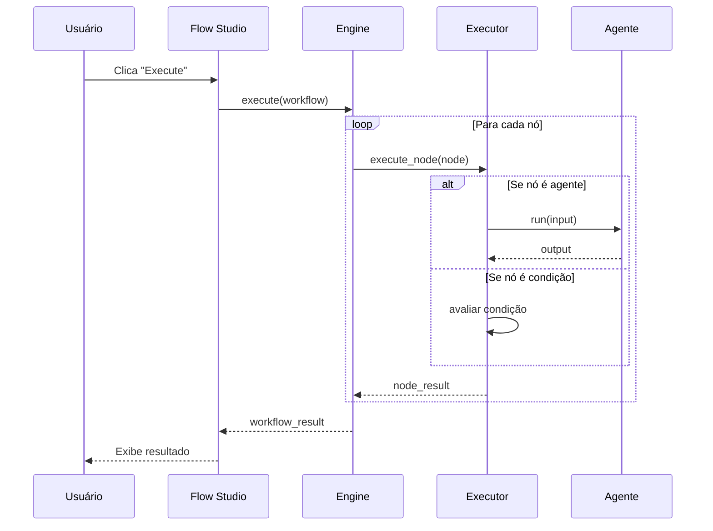
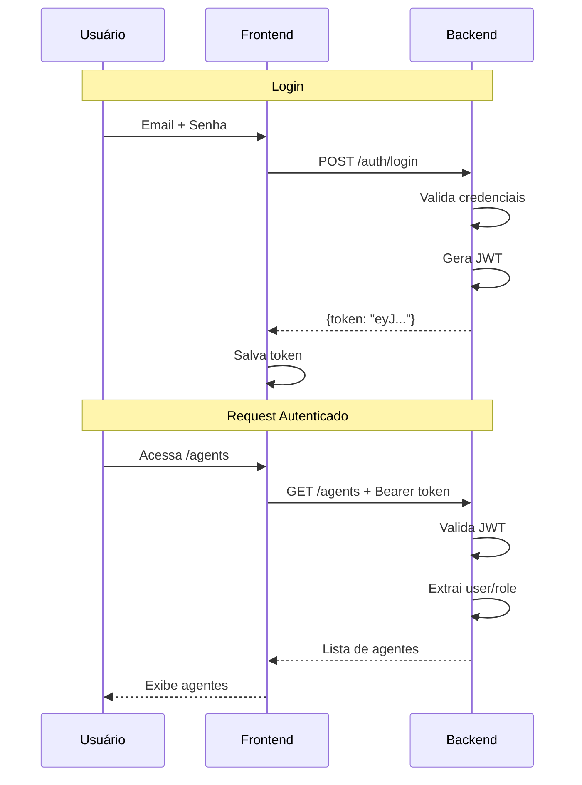
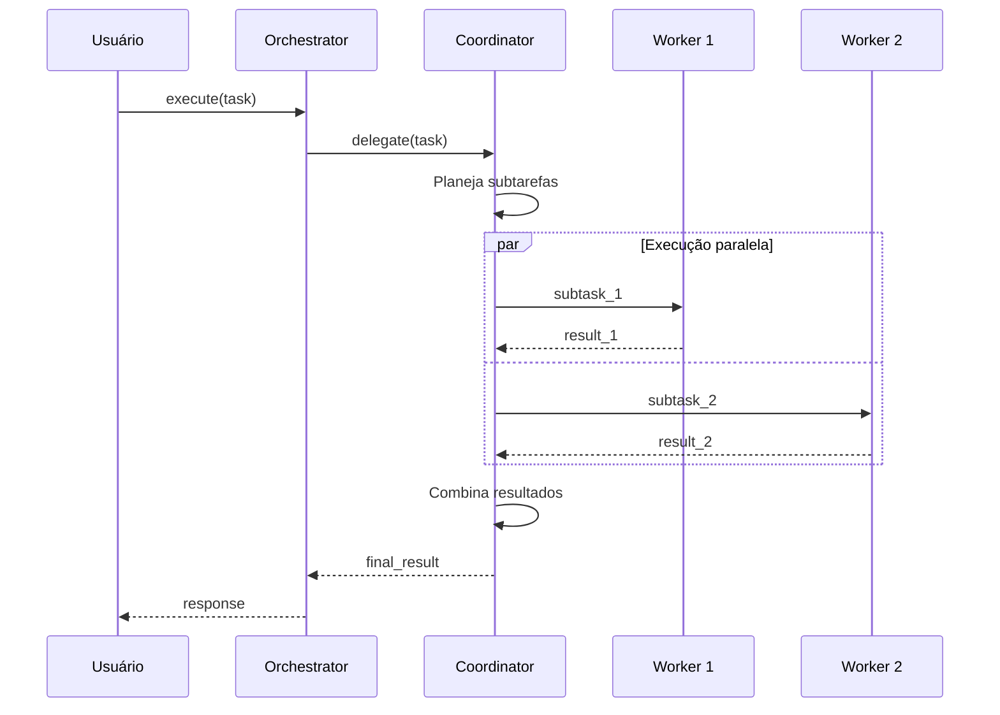

# Fluxos Principais

> Documentação dos fluxos críticos end-to-end da plataforma.

---

## 1. Fluxo de Chat com Agente

### Descrição
Usuário envia mensagem, agente processa e responde.

### Diagrama



### Diagrama ASCII

```
Usuário    Frontend    Backend    Agente    LLM
   │           │           │         │        │
   │──mensagem─►           │         │        │
   │           │──POST────►│         │        │
   │           │           │──proc.──►        │
   │           │           │         │──req.──►
   │           │           │         │◄─resp.─│
   │           │           │◄─resp.──│        │
   │           │◄──JSON────│         │        │
   │◄─display──│           │         │        │
```

### Código Relevante

- **Frontend:** `frontend/app/chat/page.tsx`
- **Backend:** `src/chat/api/routes.py`
- **Agente:** `src/agents/base_agent.py`

---

## 2. Fluxo de RAG Query

### Descrição
Usuário faz pergunta, sistema busca contexto relevante e gera resposta.

### Diagrama



### Diagrama ASCII

```
Usuário    Backend    RAGService    ChromaDB    LLM
   │          │            │            │         │
   │──query──►│            │            │         │
   │          │──query────►│            │         │
   │          │            │──embed────►│         │
   │          │            │◄─chunks────│         │
   │          │            │──context──────────►│
   │          │            │◄──response────────│
   │          │◄─result────│            │         │
   │◄─JSON────│            │            │         │
```

### Código Relevante

- **Router:** `src/os/routes/rag.py`
- **Service:** `src/rag/service.py`
- **Chunking:** `src/rag/chunking.py`

---

## 3. Fluxo de Execução de Workflow (Flow Studio)

### Descrição
Usuário executa workflow visual, sistema processa nós sequencialmente.

### Diagrama



### Diagrama ASCII

```
Usuário    FlowStudio    Engine    Executor    Agente
   │           │            │          │          │
   │──execute──►            │          │          │
   │           │──execute──►│          │          │
   │           │            │──node───►│          │
   │           │            │          │──run────►│
   │           │            │          │◄─output──│
   │           │            │◄─result──│          │
   │           │            │   (loop) │          │
   │           │◄─result────│          │          │
   │◄─display──│            │          │          │
```

### Código Relevante

- **API:** `src/flow_studio/api/`
- **Engine:** `src/flow_studio/engine.py`
- **Executor:** `src/flow_studio/executor.py`

---

## 4. Fluxo de Autenticação JWT

### Descrição
Usuário faz login, recebe token JWT, usa para acessar recursos protegidos.

### Diagrama



### Diagrama ASCII

```
                    LOGIN
Usuário    Frontend    Backend
   │           │          │
   │──creds───►│          │
   │           │──POST───►│
   │           │          │──valida
   │           │          │──gera JWT
   │           │◄─token───│
   │           │──salva   │

               REQUEST AUTENTICADO
   │──acessa──►│          │
   │           │──GET+JWT►│
   │           │          │──valida JWT
   │           │◄─data────│
   │◄─display──│          │
```

### Código Relevante

- **Router:** `src/os/routes/auth.py`
- **JWT:** `src/auth/jwt.py`
- **Dependencies:** `src/auth/deps.py`

---

## 5. Fluxo de Orquestração de Time

### Descrição
Time de agentes executa tarefa complexa com coordenador delegando para workers.

### Diagrama



### Diagrama ASCII

```
Usuário    Orchestrator    Coordinator    Worker1    Worker2
   │            │               │            │          │
   │──execute──►│               │            │          │
   │            │──delegate────►│            │          │
   │            │               │──plan      │          │
   │            │               │            │          │
   │            │               │──task1────►│          │
   │            │               │──task2───────────────►│
   │            │               │◄─result1──│          │
   │            │               │◄─result2─────────────│
   │            │               │──combine   │          │
   │            │◄──result──────│            │          │
   │◄─response──│               │            │          │
```

### Código Relevante

- **API:** `src/team_orchestrator/api/`
- **Engine:** `src/team_orchestrator/engine.py`
- **Modes:** `src/team_orchestrator/modes/`

---

## Resumo dos Fluxos

| Fluxo | Complexidade | Latência Típica | Componentes |
|-------|--------------|-----------------|-------------|
| Chat simples | Baixa | 1-3s | Frontend → Backend → LLM |
| RAG Query | Média | 2-5s | Backend → ChromaDB → LLM |
| Workflow | Alta | 5-30s | Engine → Executors → Agents |
| Auth | Baixa | <100ms | Backend (JWT) |
| Team Orchestration | Alta | 10-60s | Coordinator → Workers |

---

## Referências

- [Visão C4](11-visao-c4.md)
- [Módulos e Limites](13-modulos-e-limites.md)
