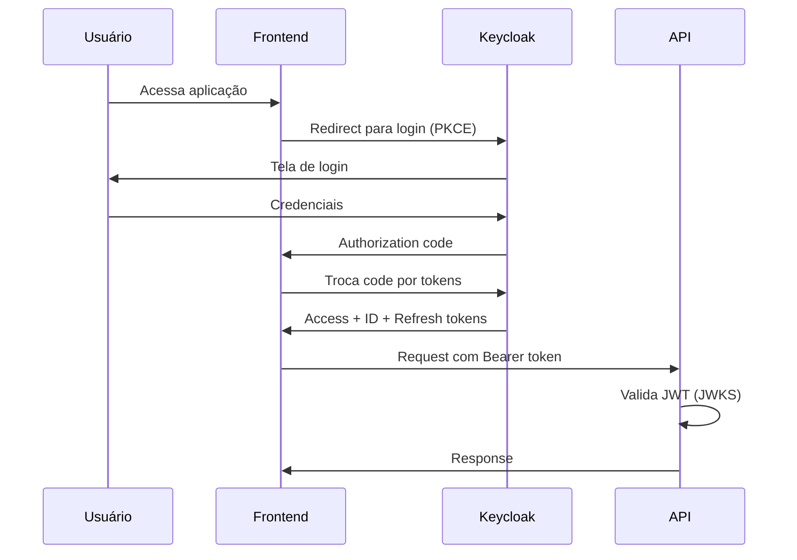
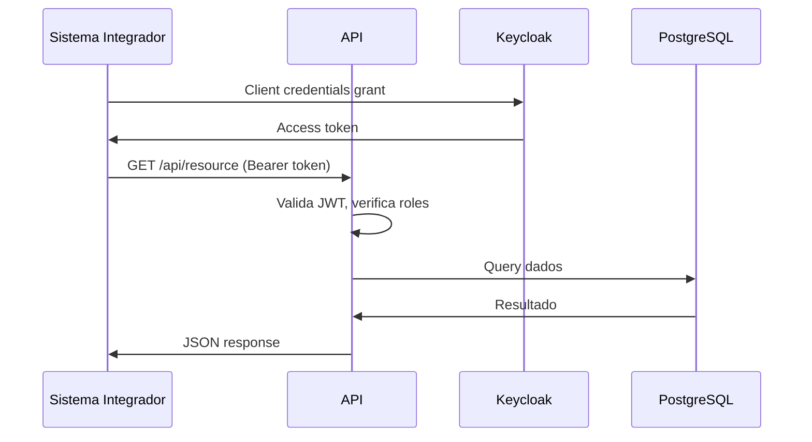

# C4 Model - Nível 1: Context Diagram

> Visão de alto nível do sistema AeroLab e suas interações externas.

## Diagrama de Contexto

```mermaid
C4Context
    title System Context Diagram - AeroLab

    Person(user, "Usuário", "Usuário final da aplicação")
    Person(admin, "Administrador", "Administrador do sistema")
    Person(integrador, "Sistema Integrador", "Aplicações externas que consomem a API")

    System(aerolab, "AeroLab", "Plataforma web corporativa com autenticação, RBAC e módulos extensíveis")

    System_Ext(keycloak, "Keycloak", "Identity Provider - Autenticação OIDC/OAuth2")
    System_Ext(postgres, "PostgreSQL", "Banco de dados relacional")
    System_Ext(redis, "Redis", "Cache e sessões distribuídas")
    System_Ext(smtp, "SMTP Server", "Envio de e-mails (opcional)")

    Rel(user, templatePlatform, "Acessa via browser", "HTTPS")
    Rel(admin, templatePlatform, "Gerencia usuários e configurações", "HTTPS")
    Rel(integrador, templatePlatform, "Consome API REST", "HTTPS + JWT")

    Rel(templatePlatform, keycloak, "Autentica usuários", "OIDC/PKCE")
    Rel(templatePlatform, postgres, "Persiste dados", "TCP/5432")
    Rel(templatePlatform, redis, "Cache e sessões", "TCP/6379")
    Rel(templatePlatform, smtp, "Envia notificações", "SMTP")
```

## Descrição dos Elementos

### Atores

| Ator                   | Descrição                                     | Interação                |
| ---------------------- | --------------------------------------------- | ------------------------ |
| **Usuário**            | Usuário final que acessa a aplicação web      | Browser via HTTPS        |
| **Administrador**      | Gerencia configurações, usuários e permissões | Browser via HTTPS        |
| **Sistema Integrador** | Aplicações externas que consomem a API        | REST API via HTTPS + JWT |

### Sistema Principal

| Sistema               | Descrição                                                                              | Tecnologia         |
| --------------------- | -------------------------------------------------------------------------------------- | ------------------ |
| **AeroLab** | Plataforma web corporativa com autenticação OIDC, RBAC, módulos extensíveis e API REST | React 18 + FastAPI |

### Sistemas Externos

| Sistema        | Propósito                                  | Protocolo          | Obrigatório        |
| -------------- | ------------------------------------------ | ------------------ | ------------------ |
| **Keycloak**   | Identity Provider - SSO, autenticação OIDC | HTTPS (porta 8080) | Sim (ou modo demo) |
| **PostgreSQL** | Persistência de dados                      | TCP (porta 5432)   | Sim                |
| **Redis**      | Cache, sessões, rate limiting              | TCP (porta 6379)   | Recomendado        |
| **SMTP**       | Notificações por e-mail                    | SMTP (porta 587)   | Opcional           |

## Fluxos Principais

### 1. Autenticação de Usuário



### 2. Integração Externa (API)



## Limites do Sistema

### Dentro do Escopo (AeroLab)

- Frontend React SPA
- API REST FastAPI
- Autenticação OIDC
- Autorização RBAC
- Módulos de negócio
- Design System
- Testes E2E

### Fora do Escopo (Sistemas Externos)

- Keycloak (Identity Provider) - provisionado separadamente
- PostgreSQL - banco de dados gerenciado
- Redis - cache distribuído
- Infraestrutura de rede/DNS
- CDN para assets estáticos

---

**Próximo nível:** [C4 Container Diagram](./c4-container.md)
