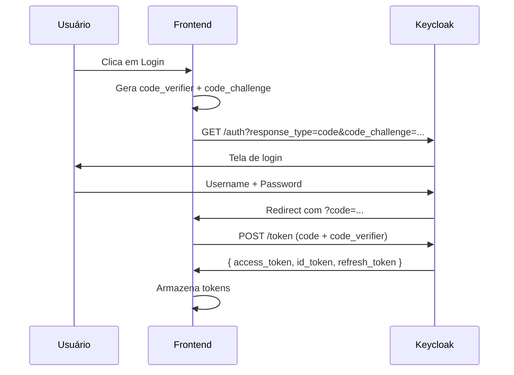
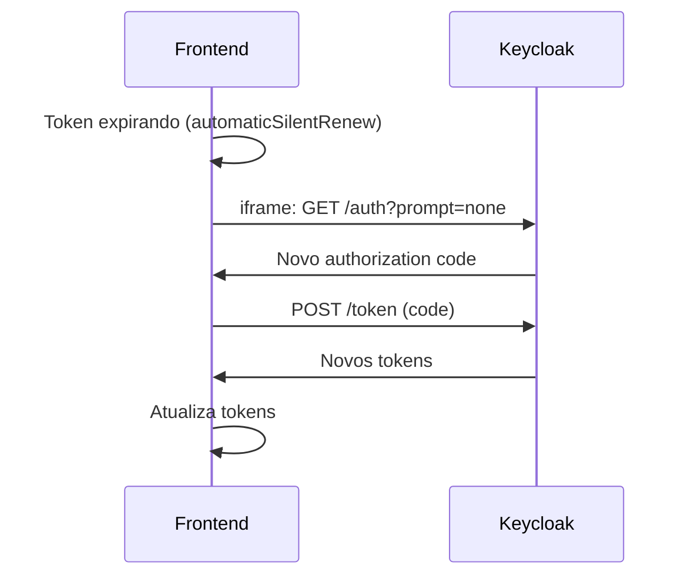
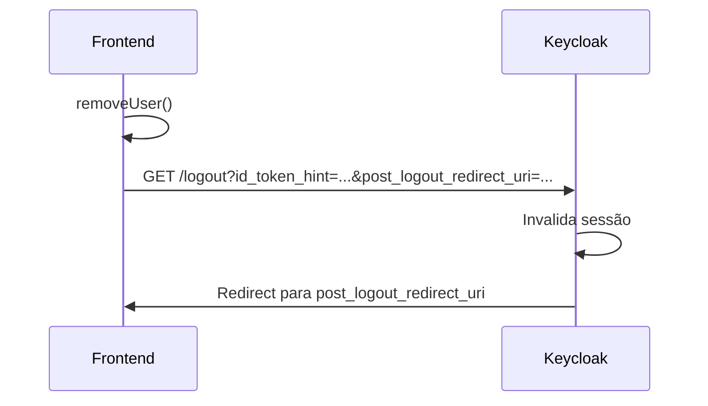

# Contrato de Integração: Autenticação

> Guia completo para integração de autenticação OIDC/JWT com o AeroLab.

**Fonte:** `packages/shared/src/auth/oidcConfig.ts`

---

## Visão Geral

O AeroLab utiliza **OpenID Connect (OIDC)** com **Keycloak** como Identity Provider. O fluxo recomendado é **Authorization Code + PKCE** para aplicações SPA.

### Especificações

| Item                  | Valor                     |
| --------------------- | ------------------------- |
| **Protocolo**         | OpenID Connect 1.0        |
| **Fluxo**             | Authorization Code + PKCE |
| **Token Format**      | JWT (RS256)               |
| **Identity Provider** | Keycloak 23+              |
| **Client Library**    | oidc-client-ts 2.4+       |

---

## Endpoints OIDC

### Descoberta (Well-Known)

```
GET {KEYCLOAK_URL}/realms/{REALM}/.well-known/openid-configuration
```

### Endpoints Principais

| Endpoint          | URL                                                                      | Método |
| ----------------- | ------------------------------------------------------------------------ | ------ |
| **Authorization** | `{KEYCLOAK_URL}/realms/{REALM}/protocol/openid-connect/auth`             | GET    |
| **Token**         | `{KEYCLOAK_URL}/realms/{REALM}/protocol/openid-connect/token`            | POST   |
| **UserInfo**      | `{KEYCLOAK_URL}/realms/{REALM}/protocol/openid-connect/userinfo`         | GET    |
| **End Session**   | `{KEYCLOAK_URL}/realms/{REALM}/protocol/openid-connect/logout`           | GET    |
| **JWKS**          | `{KEYCLOAK_URL}/realms/{REALM}/protocol/openid-connect/certs`            | GET    |
| **Introspect**    | `{KEYCLOAK_URL}/realms/{REALM}/protocol/openid-connect/token/introspect` | POST   |

### Valores Padrão

```
KEYCLOAK_URL = http://localhost:8080
REALM = template
CLIENT_ID = template-web
```

**Fonte:** `packages/shared/src/auth/oidcConfig.ts:16-18`

---

## Configuração do Cliente OIDC

### Exemplo Completo (oidc-client-ts)

```typescript
// Fonte: packages/shared/src/auth/oidcConfig.ts
import { UserManagerSettings, WebStorageStateStore } from 'oidc-client-ts'

const KEYCLOAK_URL = import.meta.env.VITE_KEYCLOAK_URL || 'http://localhost:8080'
const KEYCLOAK_REALM = import.meta.env.VITE_KEYCLOAK_REALM || 'template'
const KEYCLOAK_CLIENT_ID = import.meta.env.VITE_KEYCLOAK_CLIENT_ID || 'template-web'
const APP_URL = import.meta.env.VITE_APP_URL || window.location.origin

export const oidcConfig: UserManagerSettings = {
  authority: `${KEYCLOAK_URL}/realms/${KEYCLOAK_REALM}`,
  client_id: KEYCLOAK_CLIENT_ID,
  redirect_uri: `${APP_URL}/auth/callback`,
  post_logout_redirect_uri: `${APP_URL}/`,
  silent_redirect_uri: `${APP_URL}/auth/silent-renew`,
  response_type: 'code',
  scope: 'openid profile email roles',
  automaticSilentRenew: true,
  loadUserInfo: true,
  monitorSession: true,
  revokeTokensOnSignout: true,
  filterProtocolClaims: true,
  // PKCE é usado automaticamente quando não há client_secret
}
```

### Rotas de Callback Necessárias

| Rota                 | Propósito                                 |
| -------------------- | ----------------------------------------- |
| `/auth/callback`     | Recebe authorization code após login      |
| `/auth/silent-renew` | Iframe para renovação silenciosa de token |
| `/auth/logout`       | Callback pós-logout (opcional)            |

---

## Estrutura do JWT

### Header

```json
{
  "alg": "RS256",
  "typ": "JWT",
  "kid": "key-id-from-keycloak"
}
```

### Payload (Claims)

```json
{
  "iss": "http://localhost:8080/realms/template",
  "sub": "user-uuid-here",
  "aud": "template-web",
  "exp": 1702756800,
  "iat": 1702753200,
  "auth_time": 1702753200,
  "jti": "token-unique-id",
  "azp": "template-web",
  "session_state": "session-uuid",
  "acr": "1",
  "scope": "openid profile email roles",

  "preferred_username": "usuario@email.com",
  "email": "usuario@email.com",
  "email_verified": true,
  "name": "Nome Completo",
  "given_name": "Nome",
  "family_name": "Completo",

  "realm_access": {
    "roles": ["ADMIN", "GESTOR"]
  },
  "resource_access": {
    "template-web": {
      "roles": ["etl-read", "users-write"]
    }
  }
}
```

### Claims Mínimas Obrigatórias

| Claim                | Tipo     | Descrição           |
| -------------------- | -------- | ------------------- |
| `sub`                | string   | ID único do usuário |
| `email`              | string   | E-mail do usuário   |
| `name`               | string   | Nome completo       |
| `realm_access.roles` | string[] | Roles do realm      |

---

## Sistema de Roles (RBAC)

### Roles Disponíveis

**Fonte:** `packages/shared/src/auth/types.ts:2`

```typescript
export type UserRole = 'ADMIN' | 'GESTOR' | 'OPERADOR' | 'VIEWER'
```

| Role       | Nível | Descrição                            |
| ---------- | ----- | ------------------------------------ |
| `ADMIN`    | 1     | Administrador - acesso total         |
| `GESTOR`   | 2     | Gestor - CRUD em módulos, relatórios |
| `OPERADOR` | 3     | Operador - operações do dia-a-dia    |
| `VIEWER`   | 4     | Visualizador - apenas leitura        |

### Hierarquia

```
ADMIN > GESTOR > OPERADOR > VIEWER
```

Roles superiores **não herdam** automaticamente as inferiores no código atual. Cada role deve ser verificada explicitamente.

### Verificação de Roles (Frontend)

**Fonte:** `packages/shared/src/auth/AuthContext.tsx:205-220`

```typescript
import { useAuth } from '@template/shared/auth'

function MyComponent() {
  const { user, hasRole, hasAnyRole } = useAuth()

  // Verificar uma role específica
  if (hasRole('ADMIN')) {
    // Apenas admins
  }

  // Verificar múltiplas roles (todas necessárias)
  if (hasRole(['ADMIN', 'GESTOR'])) {
    // Precisa ter ADMIN E GESTOR
  }

  // Verificar se tem qualquer uma das roles
  if (hasAnyRole(['ADMIN', 'GESTOR'])) {
    // ADMIN OU GESTOR
  }
}
```

### Proteção de Rotas

```tsx
import { ProtectedRoute } from '@template/shared/auth'

;<Route
  path="/config"
  element={
    <ProtectedRoute requiredRoles={['ADMIN']}>
      <ConfigPage />
    </ProtectedRoute>
  }
/>
```

---

## Validação de JWT (Backend)

### Obter JWKS

```bash
curl -X GET "http://localhost:8080/realms/template/protocol/openid-connect/certs"
```

Resposta:

```json
{
  "keys": [
    {
      "kid": "key-id",
      "kty": "RSA",
      "alg": "RS256",
      "use": "sig",
      "n": "...",
      "e": "AQAB"
    }
  ]
}
```

### Exemplo de Validação (Python/FastAPI)

```python
from jose import jwt, JWTError
import httpx

KEYCLOAK_URL = "http://localhost:8080"
REALM = "template"
AUDIENCE = "template-web"

# Cache JWKS (recomendado)
_jwks_cache = None

async def get_jwks():
    global _jwks_cache
    if _jwks_cache is None:
        async with httpx.AsyncClient() as client:
            resp = await client.get(
                f"{KEYCLOAK_URL}/realms/{REALM}/protocol/openid-connect/certs"
            )
            _jwks_cache = resp.json()
    return _jwks_cache

async def validate_token(token: str) -> dict:
    """Valida JWT e retorna payload."""
    jwks = await get_jwks()

    try:
        payload = jwt.decode(
            token,
            jwks,
            algorithms=["RS256"],
            audience=AUDIENCE,
            issuer=f"{KEYCLOAK_URL}/realms/{REALM}"
        )
        return payload
    except JWTError as e:
        raise HTTPException(401, f"Invalid token: {e}")

def extract_roles(payload: dict) -> list[str]:
    """Extrai roles do payload JWT."""
    roles = []

    # Realm roles
    realm_roles = payload.get("realm_access", {}).get("roles", [])
    roles.extend(realm_roles)

    # Client roles
    client_roles = payload.get("resource_access", {}).get(AUDIENCE, {}).get("roles", [])
    roles.extend(client_roles)

    return list(set(roles))  # Remove duplicatas
```

---

## Fluxo de Autenticação

### Login (Authorization Code + PKCE)



### Renovação Silenciosa



### Logout



---

## Modo Demo/E2E

Para desenvolvimento e testes sem Keycloak, existe um **bypass de autenticação**.

### Ativação

```bash
# .env ou variáveis de ambiente
VITE_DEMO_MODE=true

# Ou modo E2E
vite --mode e2e
```

### Usuário Mock

**Fonte:** `packages/shared/src/auth/AuthContext.tsx:284-290`

```typescript
const mockUser: AuthUser = {
  id: 'demo-user-001',
  email: 'demo@template.com',
  name: 'Demo User',
  roles: ['ADMIN', 'GESTOR', 'OPERADOR', 'VIEWER'],
}
```

### Controlar Roles em E2E

```bash
# Via query params
http://localhost:13000?e2e-roles=ADMIN,GESTOR

# Via localStorage
localStorage.setItem('e2e-roles', JSON.stringify(['VIEWER']))
```

---

## Troubleshooting

### Token Inválido (401)

1. Verificar se o token não expirou (`exp` claim)
2. Verificar se o audience está correto
3. Verificar se o issuer está correto
4. Verificar se o JWKS está acessível

### CORS Errors

Verificar se o Keycloak permite a origem:

- Keycloak Admin → Clients → template-web → Web Origins

### Silent Renew Falha

1. Verificar se `/auth/silent-renew` está configurado
2. Verificar cookies de terceiros no browser
3. Verificar se session idle timeout não expirou no Keycloak

---

## Referências

- [OIDC Core Spec](https://openid.net/specs/openid-connect-core-1_0.html)
- [PKCE RFC 7636](https://datatracker.ietf.org/doc/html/rfc7636)
- [Keycloak Documentation](https://www.keycloak.org/documentation)
- [oidc-client-ts](https://github.com/authts/oidc-client-ts)

---

**Arquivos relacionados:**

- `packages/shared/src/auth/oidcConfig.ts`
- `packages/shared/src/auth/AuthContext.tsx`
- `packages/shared/src/auth/types.ts`
- `infra/keycloak/` (realm export)
